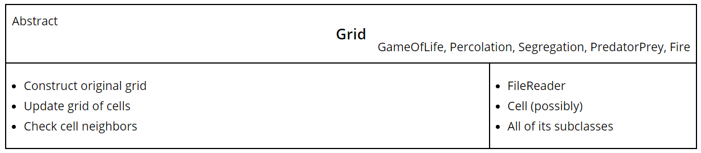

# Simulation Design Plan
### Team Number 21
### Names Austin Odell, Robert Chen, Nevzat Sevim

## Introduction
The goal of this program is to animate any 2D cellular automata simulation. A cellular automata consists of a grid of cells
where each cell has a current state and a defined set of neighbors, normally adjacent cells. The cells go through generations
where there current state is updated based on the state of their neighbors. 

The primary design goal of this project is to adhere to object-oriented design principles to help make the project flexible.
This is most necessary in the set-up of the simulation where the program need to be able to configure itself based on
rules and initial values read in from a XML text file. 

The project will be broken up into three logical sections: Configuration, Simulation and Visualization

- Configuration
:The goal of this part of the program is to reads in and set the rules, create the grid, and set the initial values of the cells. 

- Simulation:
This handles most of the "back-end" of the program. It updates the values of the cells according to the rules it gets from the configuration.

- Visualization: This takes the current state of the board and displays it to the user. It will update the display after
 every generation. 
## Overview

The Grid class is an abstract class that has a subclass for each of the simulation types, which will provide their own
implementations of rules. Classes and methods will be described in detail in Design Details. Everything else can be
found in the CRC cards.

## User Interface

###Interaction Panel
There will be a panel on the left side of the window that has the buttons and menus for user input. 

- Simulation select: Drop down menu with different simulation types
- Play Button: Moves the simulation along at the selected speed
- Pause Button: Pauses the automatic changing of generations
- Speed Slider: Changes the speed at which the simulation moves through generations. 
- Step Button: Moves to next generation

###Grid Display
On the right half will be the visualization of the grid with different colors corresponding to different cell states.

###Bottom display
Along the bottom of the window there will be panel a that displays the legend, (i.e. what each color in the grid means). 
This bottom panel can also be used to display error messages to the user if the XML file is bad

## Design Details
### Grid 
To create the original grid, the main class will construct a new grid, passing in the size of the grid as well as the 
initial values for the cells. The grid will be implemented as a 2D array, or possibly a map. 
The grid will have lookup capabilities in which you pass it a coordinate pair and it will tell return if the cell need
to be updated by checking the values of the neighboring cells. This method will be able to check if the cell is on an edge.
If it is then it will adjust which cells to check as neighbors. Since Grid will be an abstract class, implemented by
each class of the five simulations, the implementation of update methods will be slightly different based on the rules of
each simulation.

### FileReader
Reads in the XML file according to choice chosen by the user via the UI drop-down. It would look up the relevant XML file
in the resources section then parse through it. Extracts which rule set to use based off game-type. The class interacts
with the Grid class.

### Cell
The Cell class is a potential class that we will have. Its responsibilities are to hold its current state, update its
state, and return its state. The class might also hold an image to represent what is in the cell to help with
visualization. Because the class isn't very active, we will continue to look for more functionalities of the class.

### Main
The Main class handles the step function, which represents each frame of the simulation. It does this by invoking a 
method in the Grid class to analyze each cell and see which ones need to be updated. The Main class also links the
classes together, so that Visualizer and Grid can communicate with each other to set the display. This will allow the
visualization to change when the user selects a different simulation type, as well as starting, stopping, and stepping
through the simulation.

### Visualizer
The Visualizer class displays what is read in from the xml file in the Grid class, and updates with each step in the
Main class.

### Use Cases
1.
2.
3.
4.
5.

## Design Considerations

#### Components

## Team Responsibilities

 * Team Member #1

 * Team Member #2

 * Team Member #3

